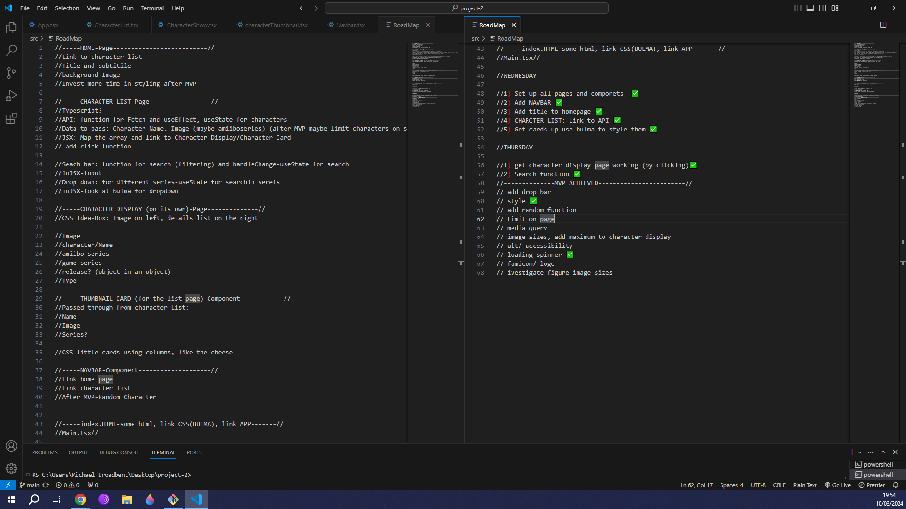
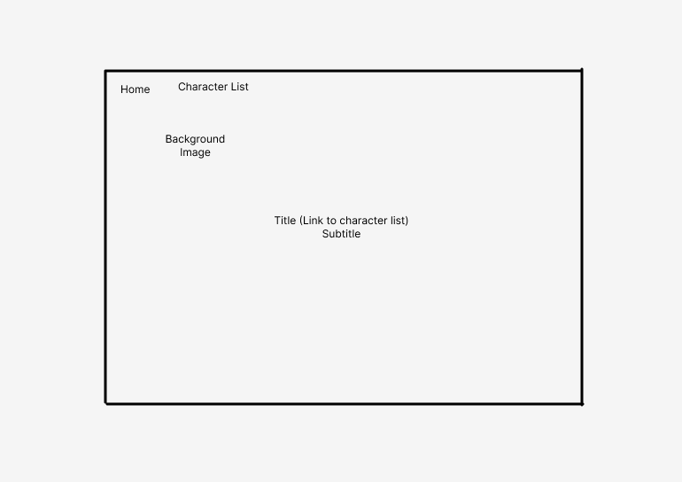
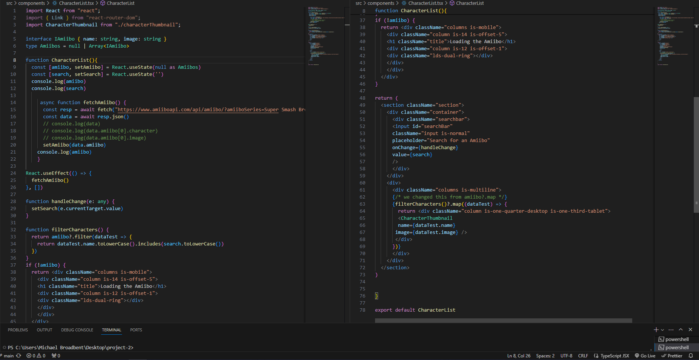
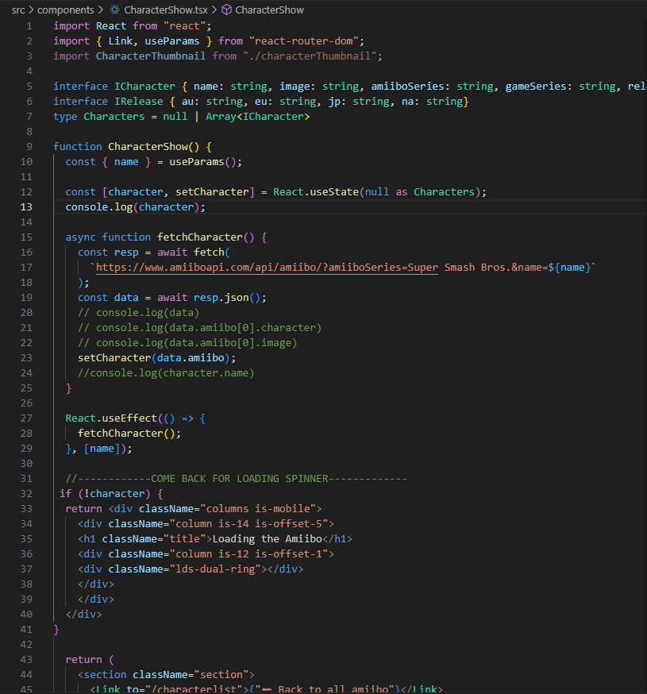
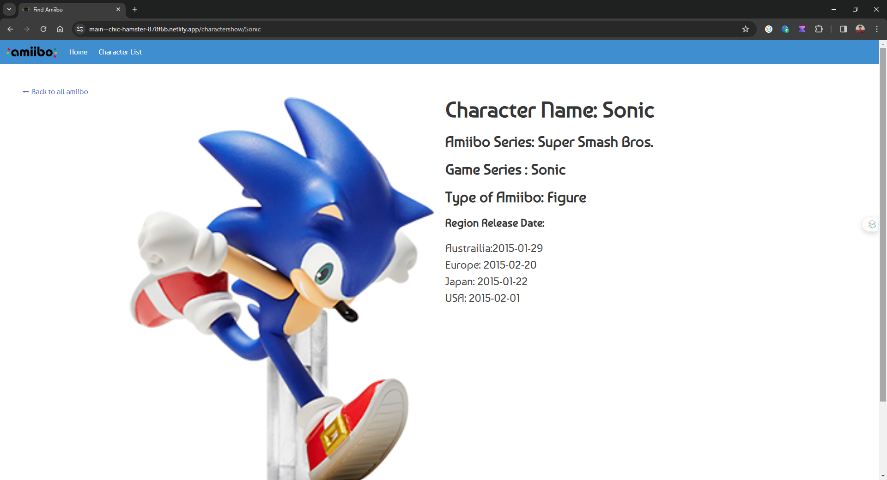

##Project 2 read me

Description;
For our second General Assembly project, we were tasked with using a publicly available API to create an interesting and useful application.
This was to be completed primarily using TypeScript and any CSS framework of our choice.
At the tail end of the project we used a website called Nelify to deploy our finished projects to the web.

Deployed Link;
(https://main--chic-hamster-878f6b.netlify.app/)

Overview and concept;
This was a group project, a team of two to achieve an interesting API use and display what we've learnt in the more recent sections of the course.

Getting Started/ Code Installation;
You might need to install node to get the Typescript to display correctly but besides that you shouldn't need anything extra to run my code.

Timeframe & Working Team;
The given timeframe for the project was almost 2 working days.
I worked in a pair with a gentleman called Matthew Hoenig.
Our working method consisted exclusively of pair programming and this was a comfortable approach for us both as it provided an invaluable opportunity to learn from eachother and see how coding is approached from an alternative perspective.

Technologies Used;
HTML - Boiler plate HTML was used for our project. We agreed this was what was required for our project scope.
CSS - We used a combination of both vanilla CSS as well as the CSS framework Bulma. This was both our first hands on with Bulma for project work and it took us a short period of time before we began to understand how useful and fast Bulma can be.
We would implemement large amounts of styles using the Bulma framework and then get into the nitty gritty parts which Bulma couldn't using vanilla CSS.
TypeScript + React - This was both our first project using Typescript & React. Both myself and Matthew had a great foundational knowledge of JavaScript and this allowed us to get a lot of programming done in a short period of time, covering eachother's weaknesses when it came to syntax errors and how best to position each function in the document to achieve our MVP in record time.
React promises and props were used to sucesssfully fetch the API data we needed and display it in a visually appealing way for our user interface.
I felt that my understanding of React props was able to solidify throughout this project.

Planning;
After deciding on which API to use and what we planned to do with it, we got to work on our Road-Map and wire frame. This would lay out the directions and goals that the project was anticipating to achieve including a day by day timeframe, when we hope to achieve MVP and any stretch goals.
The Road-Map is still present in the code but here is an image:

and here is the wireframe:

I took it upon myself to direct the flow of the tasks and anticipate what we would need to achieve by which dates.
As mentioned previously, this was a pair programming experience, consisting of the driver and navigator system, we would switch our roles regularly every 60 - 90 mins.
As such our programming achievements were shared throughout the project.

Build/code Process;
In the 2 weeks leading up to this project we were shown how to achive effective use of an API. As such we took inspiration from those lessons and opted to use the amiibo API to display a limited amount of amiibo's as cards on a horizontal row of 4 cards and continuing as you would scroll down the page.

An amiibo is a particular type of merchandise distributed by the famous computor games company Nintendo. It can include figurines, collectable cards or even plushies made of quality yarn.

3 pages would be necessary, a home page, character list page, and character display page.
As per our Road-Map, we had a strong idea of the technologies and associated functions we would need to use.
If impemented correctly we could implement plenty of our stretch goals and really flesh out this project.

In this component we would fetch the amiibo API and narrow it down immediately to the Super Smash Brother filter, without this we would have over 1000 results on one page which is a big no no for page speed and would not provide a positive user experience.
As such, an apt stretch goal would be to limit the amount shown by the API on screen, then we could utilise the full array.

We make appropriate use of React STATE to fetch and then filter the API data as necessary. The data points we wanted returned on our cards were name and image.
We were able to implement a search bar which could filter through the API based on what the user typed, i.e. if you entered "Sonic" or "Mario" into the input it would filter and display immediately.

Lastly we added a loading spinner to make best use of those annoyingly slow moments which the API would not be available upon loading the page. This component achieves its goal of providing a smooth UI experience with precise functionality.

But just displaying a name and image of your favourite Nintendo character might be too shallow an experience.
In light of this we added the ability to click on your card of choice and be taken to a new page with more additional details on your target.
This was our CharacterShow function and it made good use of React's props feature to pass through the information obtained through clicking on your card and then display additional information from the API.

The returned page looks slick and clearly displays the additional information.

Challenges;
The key challenges for us this project were:

- Getting the correct information from the API-
  In the beginning we would encounter the ".map is not a function" error and this was confusing until we figured out that we just needed to be more specific with where we called our mapping in the array and even .map multiple times in the same function if necessary.

- The page design displaying as intended-
  CSS and Bulma proved to be a larger consumption of our project time than we had anticipted. The new framework proved to be counter-intuitive for the larger part of our project and we spent more time understanding it. In light of how much time we were devoting to this, the decision was made to achieve 80% of our wireframe design and move on.

- Problem Solving in Deployment
  Upon deployment, we discovered that the logo we had set in the top left of our Navbar was not displaying correctly.
  It was discovered that the website we were using for deployment, Nelify, required that we store our files in a specific fashion. As such, we created a new assets folder in the src and moved our logo there.

  Wins;
  I am most proud of the effective teamwork shared between myself and Matthew. We had a clear vision in mind and set to work to craft it to the tight deadline as best we could. I learned a lot watching the way he problem solved and coded his functions.
  The Road-Map we invested in at the start of the project helped structure our coding and keep us right on schedule, it kept us from spending too much time on less critical aspects of the project as well as filling us with a strong feeling of pride and accomplishment when we learned that we were ahead of schedule.
  The final result of the project looks slick with a smooth colour palette, and is very user friendly.
  I feel much more confident using API's via React's STATE, it feels good knowing that this is a popular industry practice and that i have learnt an essential skill which i will use in industry later down the line.

  Bugs;
  Image aspect ratio - the images stored within the API vary in size and we were not able to come up with a solution to lock the displayed image size before deployment. As such it can disrupt the flow of the website and affect the user experience.
  Multiple Images - Particular characters in the API, namely Mario, Cloud or Corrine, contain multiple images with their datasets. If they are selected for the CharacterShow page, another image will start to appear off to the right of the screen, this looks terrible and unprofessional. Had we more time this would be a priority bug to fix.

  Future Improvements;

- Fix all previously mentioned bugs to improve the user experience.
- Options to filter based on data from the API like game series, order of release.
- Image size aspect ratio locking.
- Random character option added to Navbar
